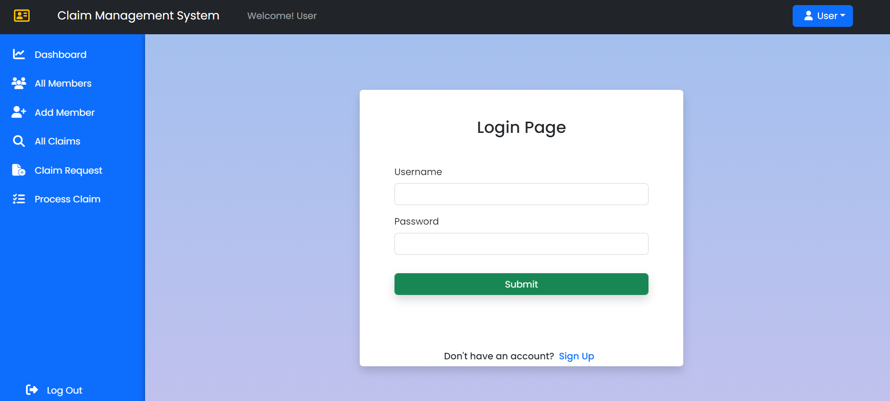
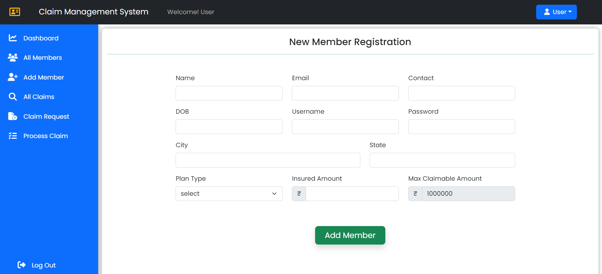
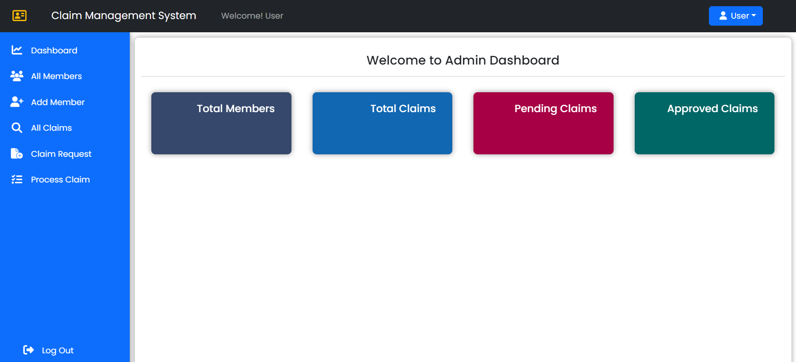
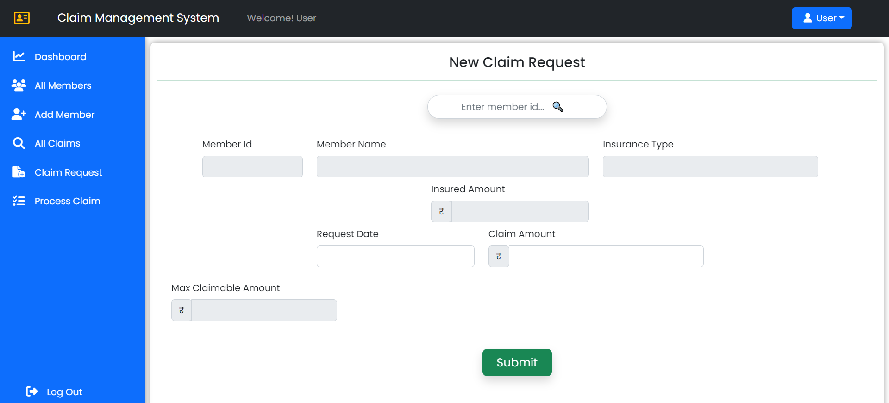
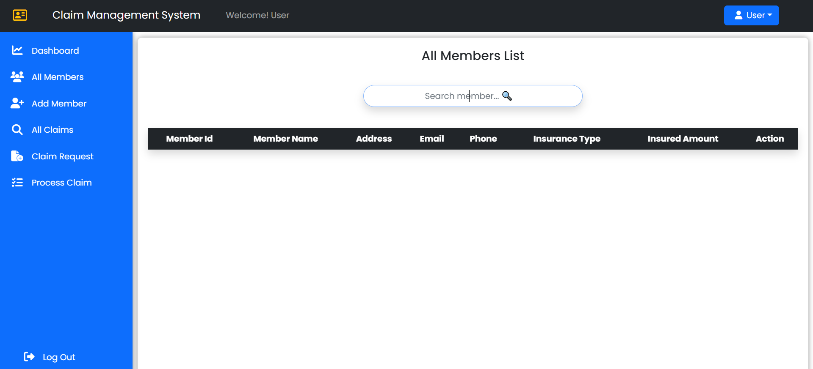
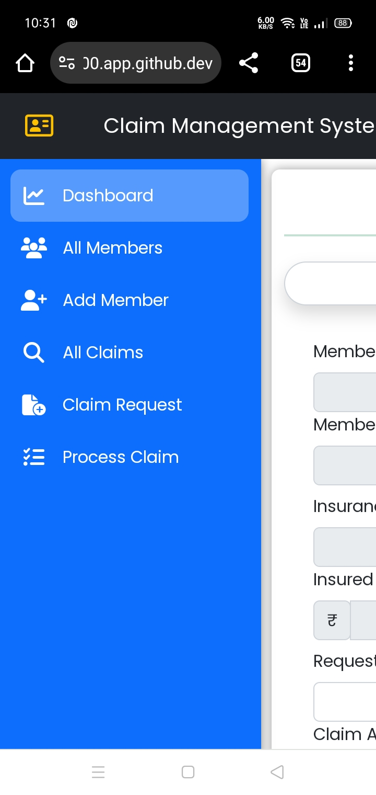

# Claim Management System

This is a Claim Management System built with React and Bootstrap 5 for the frontend.

## Table of Contents

- [About](#about)
- [Technologies Used](#technologies-used)
- [Features](#features)
- [Getting Started](#getting-started)
- [Installation](#installation)
  

## About

The Claim Management System is a web-based application that allows users to manage and process insurance claims efficiently. It provides a user-friendly interface for creating, updating, and viewing claims.

## Technologies Used

- **Frontend**:
  - React
  - Bootstrap 5
  - HTML/CSS

## Features

- ### User authentication (login, SignUp, log Out)
    
    
- ### Dashboard for an overview of claims
    
- ### Create new claims with relevant details
    
    

- ### View and search through existing claims
    
- ### Responsive design for mobile and desktop browsers
    


### Prerequisites

- Node.js (npm)

### Installation

1. **Clone the repository**

   ```bash
   git clone git@github.com:Biman-pakhira/Claim-Management-System.git
   ```
2. **Change the Directory**

   ```bash
    cd your Directory
   ```
3. **Run this Project**

   ```bash
    npm start
   ```
